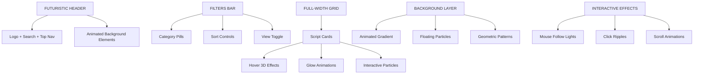

# ShellVault - Koncepcja Futurystycznego Redesignu

## Nowy Layout - Top Navigation + Full-Width Grid

### Struktura Strony
```
┌─────────────────────────────────────────┐
│           FUTURISTIC HEADER             │
│  ┌─────────────────────────────────────┐│
│  │ Logo + Search + Top Navigation      ││
│  └─────────────────────────────────────┘│
└─────────────────────────────────────────┘
┌─────────────────────────────────────────┐
│           FILTERS BAR (TOP)             │
│  [All] [Categories] [Tags] [Sort]       │
└─────────────────────────────────────────┘
┌─────────────────────────────────────────┐
│         FULL-WIDTH SCRIPT GRID          │
│  ┌──────┐ ┌──────┐ ┌──────┐ ┌──────┐   │
│  │Script│ │Script│ │Script│ │Script│   │
│  │ Card │ │ Card │ │ Card │ │ Card │   │
│  └──────┘ └──────┘ └──────┘ └──────┘   │
│                                         │
│  ┌──────┐ ┌──────┐ ┌──────┐ ┌──────┐   │
│  │ ...  │ │ ...  │ │ ...  │ │ ...  │   │
│  └──────┘ └──────┘ └──────┘ └──────┘   │
└─────────────────────────────────────────┘
┌─────────────────────────────────────────┐
│         FUTURISTIC FOOTER               │
└─────────────────────────────────────────┘
```

## Nowy System Kolorów

### Paleta Główna
- **Tło**: Animowany gradient (ciemny fiolet → głęboki niebieski → czarny)
- **Akcentowe**:
  - Elektryczny niebieski (#0066ff, #00aaff)
  - Neon fiolet (#8800ff, #bb00ff)
  - Świecący cyan (#00ffff, #66ffff)
  - Złoty akcent (#ffaa00, #ffdd44)

### Animowany Gradient Tło
```css
background: linear-gradient(135deg,
  #1a0033 0%,     /* Ciemny fiolet */
  #000066 25%,    /* Głęboki niebieski */
  #001133 50%,    /* Ciemnogranatowy */
  #000000 75%,    /* Czarny */
  #330066 100%    /* Fioletowy powrót */
);
animation: gradientShift 15s ease-in-out infinite;
```

## Efekty Wizualne

### 1. Animowane Tło
- Powolnie zmieniający się gradient (animation: 15s infinite)
- Floating cząsteczki światła
- Geometryczne wzory w tle

### 2. Efekty Świetlne
- **Glow effects** na wszystkich elementach interaktywnych
- **Pulsujące światła** na przyciskach i linkach  
- **Neon borders** z animowaną intensywnością
- **Box-shadow** z kolorowymi świeceniami

### 3. Zaawansowane Animacje
- **Hover effects** z transformacjami 3D
- **Floating animations** na kartach
- **Typing effects** ulepszony o więcej dynamiki
- **Particles system** w tle

## Komponenty UI

### Karty Skryptów
- Przezroczyste tło z blur efektem
- Animowane borders z gradient
- 3D hover transformacje
- Świecące ikony

### Przyciski
- Gradient backgrounds
- Animowane glow effects
- Ripple effect przy kliknięciu
- 3D transformacje

### Input Pola
- Futurystyczne styling z neon borders
- Animowane placeholders
- Glow focus effects
- Holographic appearance

### Nawigacja
- Floating sidebar z blur efektem
- Animowane przejścia między kategoriami
- Hover effects z light trails

## Animacje i Interakcje

### 1. Page Load Animations
- Staggered animations dla elementów
- Fade-in z direction effects
- Progressive disclosure

### 2. Scroll Animations
- Parallax effects na tle
- Elements fade-in podczas scrollowania
- Dynamic gradient shifts

### 3. Interactive Effects
- Mouse-follow light effects
- Click ripple animations
- Hover state transformations

## Futurystyczne Elementy

### 1. HUD Style Interface
- Sci-fi style borders
- Data visualization elements
- Terminal-inspired typography

### 2. Holographic Effects
- CSS 3D transforms
- Perspective animations
- Layered transparency

### 3. Cyber Aesthetics
- Glitch effects (subtly)
- Circuit board patterns
- Digital noise textures

## Responsywność

- Mobile-first approach z zachowaniem efektów
- Adaptive animations (redukowane na słabszych urządzeniach)
- Touch-friendly interactions z haptic feedback styling

## Techniczne Aspekty

### CSS Features
- CSS Custom Properties dla themowania
- CSS Grid i Flexbox dla layoutu
- CSS Animations i Keyframes
- CSS Filters dla efektów

### JavaScript Enhancements
- Intersection Observer dla scroll animations
- Mouse tracking dla interactive effects
- Performance optimization dla animacji
- Accessibility considerations

## Nowy Layout - Top Navigation + Full-Width Grid

### Struktura Strony
```
┌─────────────────────────────────────────┐
│           FUTURISTIC HEADER             │
│  ┌─────────────────────────────────────┐│
│  │ Logo + Search + Top Navigation      ││
│  └─────────────────────────────────────┘│
└─────────────────────────────────────────┘
┌─────────────────────────────────────────┐
│           FILTERS BAR (TOP)             │
│  [All] [Categories] [Tags] [Sort]       │
└─────────────────────────────────────────┘
┌─────────────────────────────────────────┐
│         FULL-WIDTH SCRIPT GRID          │
│  ┌──────┐ ┌──────┐ ┌──────┐ ┌──────┐   │
│  │Script│ │Script│ │Script│ │Script│   │
│  │ Card │ │ Card │ │ Card │ │ Card │   │
│  └──────┘ └──────┘ └──────┘ └──────┘   │
│                                         │
│  ┌──────┐ ┌──────┐ ┌──────┐ ┌──────┐   │
│  │ ...  │ │ ...  │ │ ...  │ │ ...  │   │
│  └──────┘ └──────┘ └──────┘ └──────┘   │
└─────────────────────────────────────────┘
┌─────────────────────────────────────────┐
│         FUTURISTIC FOOTER               │
└─────────────────────────────────────────┘
```

## Mermaid Diagram - Nowa Architektura



## Implementacja - Kluczowe Zmiany

### 1. HTML Structure Changes
- Usunięcie sidebar, przeniesienie kategorii do top bar
- Pełnej szerokości grid container
- Nowe sekcje dla effects i particles

### 2. CSS Architecture
- Nowy system CSS custom properties
- Modularny CSS dla effects
- Performance-optimized animations

### 3. JavaScript Enhancements  
- Mouse tracking system
- Particles animation engine
- Enhanced filtering z animacjami

### 4. Assets do Dodania
- Particle textures/sprites
- Geometric SVG patterns
- Glow effect gradients